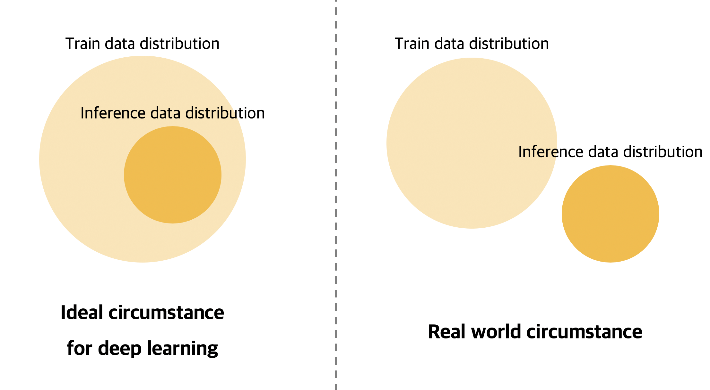
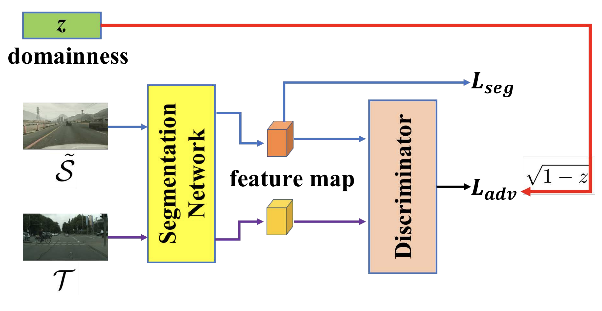
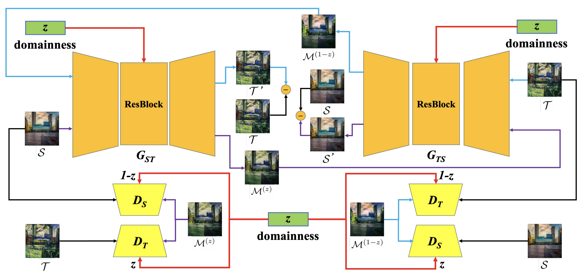

# [DLOW : Domain Flow for Adaptation and Generalization](http://openaccess.thecvf.com/content_CVPR_2019/papers/Gong_DLOW_Domain_Flow_for_Adaptation_and_Generalization_CVPR_2019_paper.pdf)

Gong, Rui, et al 

2019 CVPR Accepted

### Table

+ [Keywords](#Keywords)
+ [Problem definition](#Problem-Definition-Unsupervised-domain-adaptation)
+ [Previous works](#Previous Works - Pixel-level Domain adaptation)

## Keywords

+ Feature interpolation
+ Domain adaptation
+ Image translation

## Problem Definition - Unsupervised domain adaptation

딥러닝은 기본적으로 Train에 사용한 데이터의 분포가 Inference시 사용할 데이터의 분포를 포함한다고 가정하며, 이러한 상황에서 훈련시킨 모델이 가장 잘 동작한다. 

하지만 실제 상황에서는 많은 데이터(Ground truth)를 만들기 위한 비용 문제, depth map과 같이 ground truth를 정확히 알기 어려운 경우 등으로 train 데이터의 분포가 inference time의 데이터 분포를 포함하지 못할 수도 있다. 

이러한 문제를 해결하기 위한 연구 분야가 바로 Domain adaptation이다.

그 중에서도 Unsupervised domain adaptation은 ground truth가 있는 source dataset과 ground truth가 없는 target dataset을 사용하여 target dataset에서 task를 잘 수행하는 모델을 만드는 것이 목표이다. 

Unsupervised domain adaptation을 사용하면 GTA5 dataset과 같이 렌더링 되어 ground truth를 알기가 매우 쉬운 synthetic dataset을 사용하여 Real world에서도 잘 동작하는 모델을 만들 수 있다.

## Previous works

Unsupervised domain adaptation에서는

### Contribution

+ Intermediate domain에 해당하는 이미지를 생성할 수 있다

+ Intermediate domain에 해당하는 이미지를 사용하여 domain adaptation task를 더 쉽게 만들 수 있다.

  

### Proposed Architecture

#####  Overall architecture

DLOW는 기본적으로 기존의 adversarial loss를 활용한 domain adaptation model 구조를 기본으로 한다.

Domain adaptation에서 

### Results

### Related work

