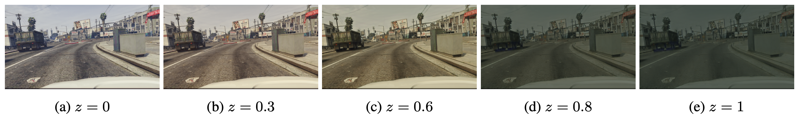

# [DLOW : Domain Flow for Adaptation and Generalization](http://openaccess.thecvf.com/content_CVPR_2019/papers/Gong_DLOW_Domain_Flow_for_Adaptation_and_Generalization_CVPR_2019_paper.pdf)

Gong, Rui, et al

2019 CVPR Accepted

## Table

+ [Keywords](#Keywords)
+ [Problem definition](#problem-definition---domain-shift)
+ [Previous works](#previous-works)
  + [Pixel-level domain adaptation](#1-pixel-level-domain-adaptation)
  + [Adversarial domain adaptation](#2-adversarial-domain-adaptation)
+ [Contribution](#main-idea)
+ [Model architecture](#proposed-architecture)
  + [Overall Architecture](#overall-architecture)
  + [Interpolation Architecture](#interpolation-architecture)
+ [Experiments](#experiments)

## Keywords

+ Feature interpolation
+ Domain adaptation
+ Image translation

## Problem Definition - Domain shift

딥러닝은 기본적으로 Train에 사용한 데이터의 분포가 Inference시 사용할 데이터의 분포를 포함한다고 가정하며, 이러한 상황에서 훈련시킨 모델이 가장 잘 동작한다.

하지만 실제 상황에서는 많은 데이터(Ground truth)를 만들기 위한 비용 문제, depth map과 같이 ground truth를 정확히 알기 어려운 경우 등으로 train 데이터의 분포가 inference time의 데이터 분포를 포함하지 못할 수도 있다. 

위의 문제를 domin shift problem이라고 하고, 이러한 문제를 해결하기 위한 연구 분야가 바로 Domain adaptation이다.

그 중에서도 Unsupervised domain adaptation은 ground truth가 있는 source dataset과 ground truth가 없는 target dataset을 사용하여 target dataset에서 task를 잘 수행하는 모델을 만드는 것이 목표이다.

Unsupervised domain adaptation을 사용하면 GTA5 dataset과 같이 렌더링 되어 ground truth를 알기가 매우 쉬운 synthetic dataset을 사용하여 Real world에서도 잘 동작하는 모델을 만들 수 있다.

## Previous works

### 1. Pixel-level domain adaptation

Pixel-level domain adaptation은 style transfer model을 기반으로 한다.

먼저 Source dataset의 distribution을 **style transfer model** 및 **discriminator** 를 사용하여 Target dataset의 distribution으로 변경한다.

이 때 Target dataset의 distribution으로 옮겨간 Source dataset은 label을 가지고 있으므로, 일반적인 딥러닝 모델처럼 **Feature extractor** 와 **task model** 이 주어진 task를 잘 수행할 수 있도록 학습시킬 수 있다.

학습을 마치면, **Feature extractor** 와 **task model** 은 Target dataset의 distribution에서 task를 수행하는 방법을 학습했으므로, Target dataset에서도 task를 수행할 수 있다.

### 2. Adversarial domain adaptation

위의 모델은 가장 기본적인 adversarial domain adaptation모델이라고 할 수 있다.

**Discriminator** 와 **feature extractor** 는 Source dataset과 Target dataset에서 동일한 distribution의 feature를 추출하는 방법을 학습하고,

**Task model** 은 해당 feature distribution에서 주어진 task를 잘 수행하는 방법을 학습한다.

pixel-level domain adaptation과 마찬가지로, 학습을 마치면 **Feature extractor** 와 **task model** 은 Target dataset의 distribution에서 task를 수행할 수 있게 된다.

## Contribution

+ Intermediate domain에 해당하는 이미지를 생성할 수 있다

  

  

  Source domain에서 Target domain까지의 flow에는 여러가지 길(연두색 선)이 있고, 논문에서는 그 중에서도 shortest path인 붉은 선 안에 있는 intermediate domain(푸른 점)을 만드는 것을 목표로 한다.

  

+ Intermediate domain에 해당하는 이미지를 사용하여 domain adaptation에 도움을 줄 수 있다.

  ​	이는 아래 논문들을 통해서 실험적으로 증명되었다.

  + [Domain adaptation for object recognition: An unsupervised approach](http://citeseerx.ist.psu.edu/viewdoc/download?doi=10.1.1.300.3323&rep=rep1&type=pdf)
  + [Geodesic flow kernel for unsupervised domain adaptation](ftp://ftp.idiap.ch/pub/courses/EE-700/material/12-12-2012/subspace-cvpr2012.pdf)
  + [Flowing on riemannian manifold: Domain adaptation by shifting covariance](http://www.vision.ee.ethz.ch/~liwenw/papers/Cui_TSMCB2013.pdf)

## Proposed Atchitecture

### Denotation

$P_{S}$ : Source domain의 distribution

$P_T$ : Target domain의 distribution

$P_M^{(z)}$ : Intermediate domain의 distribution

$x_t \in S$ : Source domain의 sample 

$x_t \in T$ : Target domain의 sample 

$\mathcal M^{(z)}$ : Intermediate domain

$z \in [0, 1]$ : Source domain에서부터 Intermediate domain 까지의 거리

​				   $z$ 가 0일 때는 Source domain

​				   $z$ 가 1일 때는 Target domain

### Interpolation Architecture

Intermediate domain을 잘 생성했다면, 아래와 같은 함수를 만족시킬 것이다.

####$${\mathcal{dist}(P_S, P_M^{(z)}) \over \mathcal{dist}(P_T, P_M^{(z)})} = {z \over 1-z}$$

따라서 아래와 같은 loss function을 최소화 하는 방식으로 모델을 학습시킬 수 있다.

$$\mathcal{L} = (1-z)\cdot\mathcal{dist}(P_S, P_M^{(z)}) + z\cdot\mathcal{dist}(P_T, P_M^{(z)})$$

$\mathcal{dist}$ 함수의 output은 discriminator를 통해 구해낸다.

Full loss function은 아래와 같다.

####$$\mathcal{L} = \mathcal{L}_{adv} + \lambda_1 \mathcal{L}_{cyc}$$

1. Adversarial Loss

   $\mathcal{L}_{adv}(G_{ST}, D_S) = \mathbb{E}_{x^s \sim P_S}[\log(D_S(x^s))] + \mathbb{E}_{x^s \sim P_S}[\log(1-D_S(G_{ST}(x^s, z)))]$

   $\mathcal{L}_{adv}(G_{ST}, D_T) = \mathbb{E}_{x^t \sim P_T}[\log(D_T(x^t))] + \mathbb{E}_{x^s \sim P_S}[\log(1-D_T(G_{ST}(x^s, z)))]$

   이 때 $D_S$ 는 $\mathcal M^{(z)}$ 과 $S$ 를 구분하는 discriminator이고, $D_T$ 는 $\mathcal M^{(z)}$ 과 $T$ 를 구분하는 discriminator이다.

   앞서 언급된 $\mathcal{dist}$ 함수의 output을 위의 두 discriminator의 output으로 치환하면

   $\mathcal{L}_{adv} = (1-z)\mathcal{L}_{adv}(G_{ST}, D_S) + z\mathcal{L}_{adv}(G_{ST}, D_T)$

   이와 같은 loss function을 얻을 수 있다.

2. Cycle Loss

   아래 loss function으로 source domain에서 intermediate domain을 거쳐 다시 원래 source domain으로 돌아올 수 있도록 학습 시킨다.

   $\mathcal L_{cyc} = \mathbb E_{x^s \sim P_S}[\Vert G_{TS}(G_{ST}(x^s, z), z) \Vert]$

   이를 통해 원래 source domain 이미지가 가지고 있던 instance들을 훼손하지 않을 수 있다.

### Overall Architecture

DLOW는 기본적으로 앞서 언급된 Adversarial domain adaptation model을 기본으로 한다.

DLOW에서는 Source dataset($S$) 대신 intermediate domain로 변환된 translated dataset($\tilde{S}$)을 사용하며,

adversarial loss를 통해 weight를 업데이트 할 때 $\sqrt{1-z_i}$ 의 weight를 곱해준다.

이때 adversarial loss는 앞서 Interpolation architexture에서 언급된 adversarial loss와는 다른, 일반적인 adversarial domain adaptation에서 사용하는 loss이다.

여기에 $\sqrt{1-z_i}$ 를 곱해줌으로써 Source domain에 가까운 intermediate domain sample이 들어왔을 때 Target domain의 feature와 더 비슷해질 수 있도록 feature distribution을 더 많이 이동시켜줄 수 있다.

## Experiments

### Interpolation Results

위의 결과는 Source domain 으로 GTA5 dataset(그래픽 이미지)을,  Target domain으로  Cityscapte dataset(실제 이미지)을 사용했을 때 Intermediate domain들을 나타낸 것이다.

### Segmentation Results 

위의 결과는 Interpolate된 Intermediate domain을 사용해 segmentation task를 수행한 결과이다.

DLOW(z=1)은 Source domain을 Target domain변경한 후 task모델을 학습시킨 것으로, 일반적인 pixel-level domain adaptation 모델과 같은 구조를 가진다.

실험 결과 CycleGAN으로 pixel-level domain adaptation을 수행했을 때와 DLOW(z=1)로 pixel-level domain adaptation을 수행했을 때 comparable한 결과가 나왔음을 알 수 있고,

Intermediate domain을 만들어 domain adaptation을 수행한 DLOW 모델의 경우 mIoU가 가장 높음을 알 수 있다.